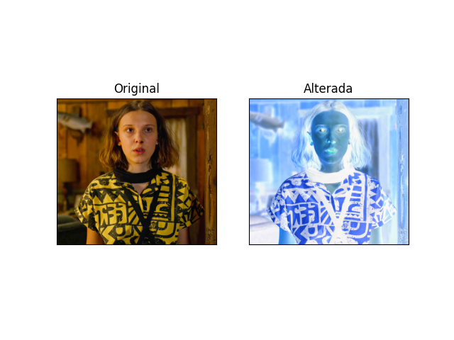
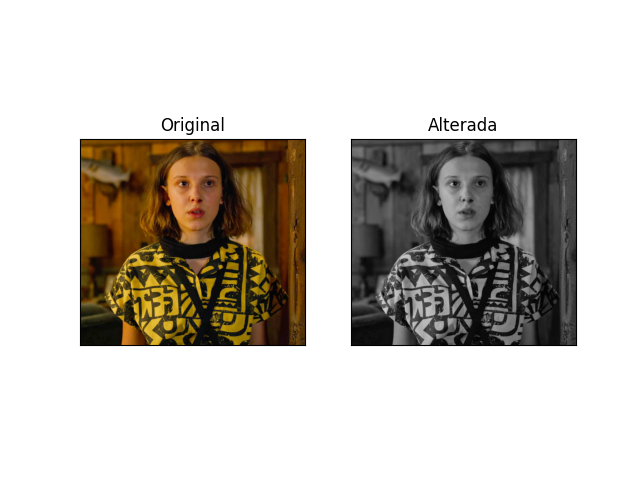
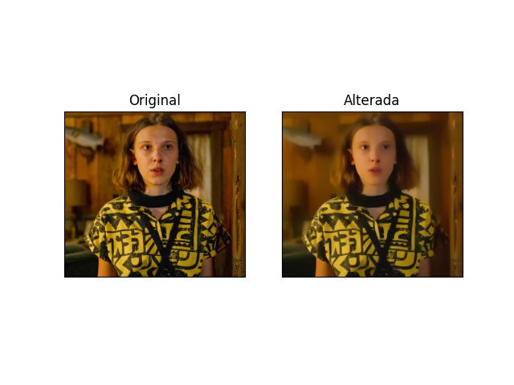
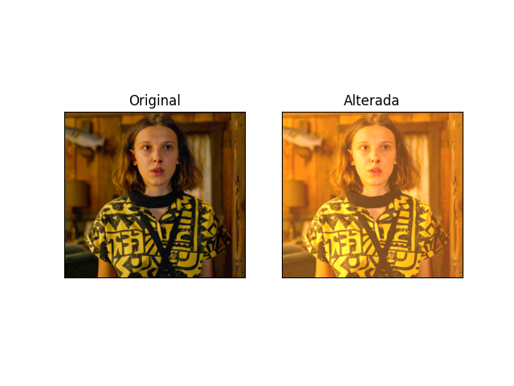
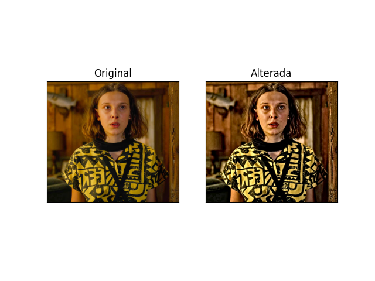

# Filtros em OpenCV

Projeto criado para teste das funções de filtro da biblioteca OpenCV em Python; foi desenvolvido como parte da avaliação da matéria de Processamento de Imagens do Bacharelado em Ciência da Computação.

## Como rodar o projeto:

<p>
1. Baixe e instale a última versão do Python (https://www.python.org/downloads/)</br>
Obs: certifique-se de habilitar a configuração automatica do path e do pip no instalador.
</p>

<p>
2. Instalar as dependências do projeto usando o pip</br>
Abra o terminal em qualquer diretorio e rode os seguintes comandos:
</p>

```
 pip install opencv-python
 pip install matplotlib
```

<p>
3. Agora pode rodar o projeto</br>
Basta abrir o terminal no diretório do projeto e rodar o seguinte comando:
</p>

```
 python main.py
```

## Filtros disponiveis:

#### Primeiro Filtro (Negativo):

<p>O primeiro filtro irá inverter os bits da imagem.</p>



#### Segundo Filtro (Cinza):

<p>O segundo filtro irá coverter o esquema de cores R G B para Cinza.</p>



#### Terceiro filtro (Blur):

<p>Aplica o efeito de Blur (borrão) na imagem usando o kernel size.</p>


#### Quarto filtro (Óleo):

<p>Aplica o efeito de Óleo (suavisação) na imagem usando filtros de convolução.</p>



#### Quinto filtro (Sépia):

<p>Aplica a máscara de cor Sépia na imagem.</p>



#### Sexto filtro (HDR Aprimorar Detalhes):

<p>Usa o 'detailEnhance' de acordo com as propriedades de sigma para aprimorar as cores.</p>



